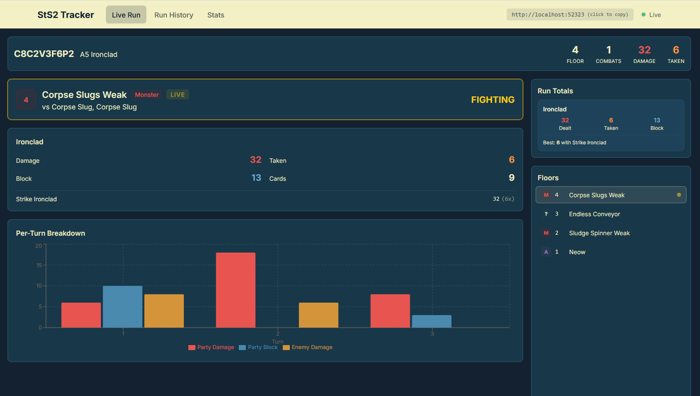
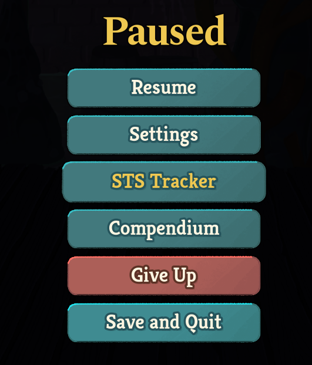

# StS2 Run Tracker

A Slay the Spire 2 mod that captures detailed per-player combat stats and displays them in a live browser dashboard. Works in both singleplayer and multiplayer. The dashboard is built into the mod -- no separate server or setup required.



## Install

1. [Download the latest release](https://github.com/Hollings/sts-run-tracker/releases) and place the files in your game's mods directory:
   ```
   <game>/mods/StS2Tracker/
       StS2Tracker.dll
       StS2Tracker.json
       web/
           index.html
           assets/
   ```

2. Launch Slay the Spire 2. Accept the mod confirmation popup, relaunch.

3. Open `http://localhost:52323` in your browser.

The pause menu also has an "STS Tracker" button that opens the dashboard directly.



## Save files

Slay the Spire 2 keeps a completely separate save profile when mods are loaded. This means your first modded launch starts fresh -- no unlocks, no run history, no progress. In order for your existing save file to be used in the modded game, you must copy the save files, replays, and history data. Close the game before copying.

Save files are located at `%APPDATA%/SlayTheSpire2/steam/<STEAM_ID>/`:
```
profile1/              <- unmodded saves
modded/profile1/       <- modded saves
```

1. Copy unmodded to modded (bring your existing progress into modded):
```bash
STEAM="$APPDATA/SlayTheSpire2/steam/<YOUR_STEAM_ID>"
cp "$STEAM/profile1/saves/"*.save "$STEAM/modded/profile1/saves/"
cp "$STEAM/profile1/saves/"*.save.backup "$STEAM/modded/profile1/saves/"
cp "$STEAM/profile1/saves/history/"* "$STEAM/modded/profile1/saves/history/"
cp "$STEAM/profile1/replays/"* "$STEAM/modded/profile1/replays/"
```

2. Copy modded to unmodded (bring modded progress back to vanilla):
```bash
cp "$STEAM/modded/profile1/saves/"*.save "$STEAM/profile1/saves/"
cp "$STEAM/modded/profile1/saves/"*.save.backup "$STEAM/profile1/saves/"
cp "$STEAM/modded/profile1/saves/history/"* "$STEAM/profile1/saves/history/"
cp "$STEAM/modded/profile1/replays/"* "$STEAM/modded/profile1/replays/"
```

## What the mod tracks

Data the base game does **not** save, captured via Harmony hooks:

| Stat | Per-player | Per-turn | Per-target |
|------|-----------|----------|------------|
| Damage dealt | Yes | Yes | Yes |
| Damage taken | Yes | - | - |
| Damage blocked | Yes | - | - |
| Block gained | Yes | Yes | - |
| Cards played | Yes | Yes | - |
| Card play sequence | Yes | Yes | Yes |
| Kills | Yes | - | - |

Pet/minion damage is attributed to the owning player.

## Building from source

Requires .NET 9 SDK and Node.js.

```bash
# Build the mod
dotnet build -p:STS2GameDir="<path to Slay the Spire 2>" StS2Tracker/

# Build the frontend
cd web/frontend && npm install && npm run build
```

Deploy `StS2Tracker/bin/StS2Tracker.dll` to `<game>/mods/StS2Tracker/` and copy `web/frontend/dist/` contents to `<game>/mods/StS2Tracker/web/`.

### Dev server (frontend hot reload)

For frontend work there's an optional Python dev server under `web/server/` that Vite proxies to. It reads directly from the game's save files, so **the dashboard works even if the StS2Tracker mod is disabled or not installed** — you lose per-combat detail (damage charts, card play sequences from in-memory combat tracking), but the map, floor history, card/relic choices, and per-floor HP/gold all still populate from whatever the game has autosaved.

When the mod *is* running, the dev server merges its live tracker JSON on top of the save data for the full experience. When it isn't, the save file alone drives the view.

```bash
pip install fastapi uvicorn watchfiles websockets pydantic
cd web/server && python -m uvicorn main:app --host 0.0.0.0 --port 8000
cd web/frontend && npm run dev   # in another terminal
```

Stale save/tracker files from previous game sessions are filtered out automatically using the mtime of the newest rotated `godot*.log`, so the dashboard shows "Waiting for Data" between runs instead of silently displaying a dead run. Set `STS2_PORT` / `STS2_BACKEND_PORT` to override port 8000 if it's taken.

**Multiplayer guest limitation:** Only the host writes `current_run_mp.save` to disk — on a guest's machine the MP run state lives purely in memory and netcode, so there's nothing for the fallback to read. If you're a guest in a multiplayer run, you must enable the StS2Tracker mod to get a live dashboard; the mod reads in-memory game state directly and works for every client regardless of host status.

This fallback only applies to the dev server. Production (the mod's embedded HTTP server on port 52323) always uses live tracker data.

## Known issues

- **Multiplayer victory summary**: The top-5 damage cards shown per player are aggregated across all players instead of being per-player.
